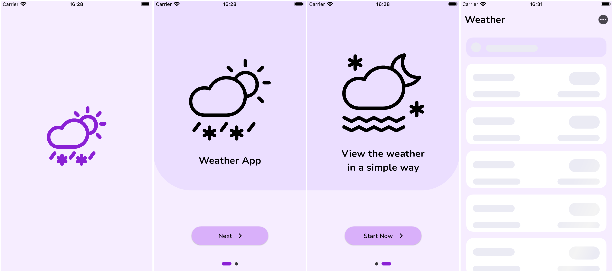
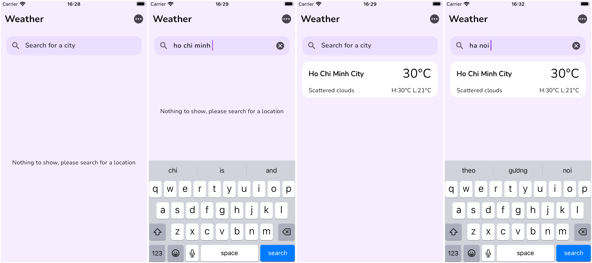
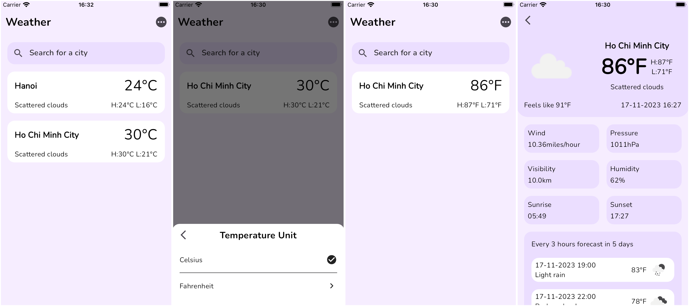

# Flutter Weather App

## Getting Started 🚀

Packages using in this source:

State Management: bloc/cubit
Networking: dio
DI: get_it
Image: cached_network_image, flutter_svg
Localization: flutter_localizations
Local storage: shared_preferences
Font: google_fonts

Screenshots:




### Run the source

To run the source, follow steps
Step 1: Open source in VSCode or any IDE.
Step 2: run ```flutter pub get```.
Step 3: run ```flutter run --flavor development --target lib/main_development.dart```
    or you can run on VSCode follow: Run -> Run Without Debugging

---

This project contains 3 flavors:

- development
- staging
- production

To run the desired flavor either use the launch configuration in VSCode/Android Studio or use the following commands:

```sh
# Development
$ flutter run --flavor development --target lib/main_development.dart

# Staging
$ flutter run --flavor staging --target lib/main_staging.dart

# Production
$ flutter run --flavor production --target lib/main_production.dart
```

---
